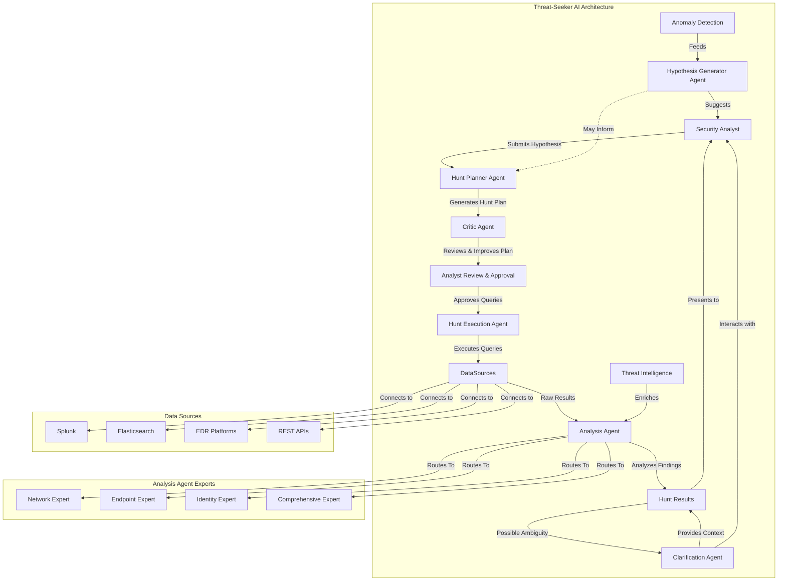

# Threat-Seeker AI Architecture

## Architecture Overview

Threat-Seeker AI uses a sophisticated multi-agent architecture to implement a complete threat hunting workflow:

1. **Hunt Planner Agent**: The entry point that converts natural language threat hypotheses into structured hunt plans with specific queries for different data sources. It maps hypotheses to MITRE ATT&CK techniques and generates appropriate queries.

2. **Critic Agent**: A new quality assurance component that reviews hunt plans before they're presented to analysts. It identifies efficiency issues, gaps in coverage, and potential false positives in generated queries, providing specific improvement suggestions.

3. **Analyst Review & Approval Gate**: A critical human-in-the-loop component where the security analyst reviews, modifies, and approves the generated queries before execution. This ensures control and prevents potentially harmful queries from running.

4. **Hunt Execution Agent**: Securely connects to configured data sources and executes the approved queries. It handles credentials securely and manages rate limiting and error handling.

5. **Analysis Agent**: Uses a Mixture of Experts (MoE) approach to analyze hunt results. It first classifies the data type, then routes analysis to specialized experts (Network, Endpoint, Identity, or Comprehensive). Each expert uses Chain of Thought (CoT) reasoning to provide justified confidence scores for findings.

6. **Clarification Agent**: Handles ambiguity by allowing the analyst to ask specific questions about the findings. It uses context from the hunt to provide detailed explanations.

7. **Hypothesis Generator Agent**: Proactively suggests new hunt hypotheses based on threat intelligence feeds and environmental context. These dynamic suggestions appear on the dashboard to help analysts identify emerging threats worth investigating.

This architecture maintains a strict separation between planning and execution for security while providing a powerful, AI-assisted workflow for threat hunting. The visual attack path correlation in the frontend helps analysts better understand the relationships between findings.