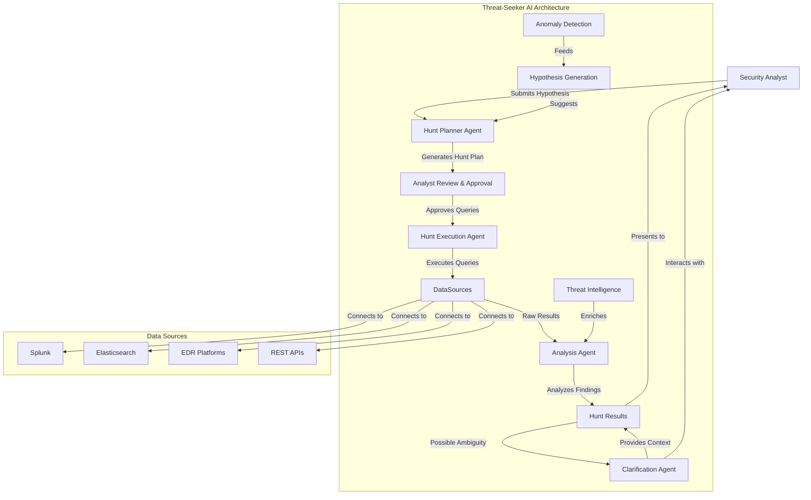

# Threat-Seeker AI Architecture

## Architecture Overview

Threat-Seeker AI uses a sophisticated multi-agent architecture based on Portia AI to implement a complete threat hunting workflow:

1. **Hunt Planner Agent**: The entry point that converts natural language threat hypotheses into structured hunt plans with specific queries for different data sources. It maps hypotheses to MITRE ATT&CK techniques and generates appropriate queries.

2. **Analyst Review & Approval Gate**: A critical human-in-the-loop component where the security analyst reviews, modifies, and approves the generated queries before execution. This ensures control and prevents potentially harmful queries from running.

3. **Hunt Execution Agent**: Securely connects to configured data sources and executes the approved queries. It handles credentials securely and manages rate limiting and error handling.

4. **Analysis Agent**: Processes the raw data returned from queries to identify patterns, anomalies, and potential threats. It filters known-good activity, enriches with threat intelligence, and ranks findings by severity and relevance.

5. **Clarification Agent**: Handles ambiguity by allowing the analyst to ask specific questions about the findings. It uses context from the hunt to provide detailed explanations.

6. **Hypothesis Generation**: An advanced component that proactively suggests new hunt hypotheses based on threat intelligence feeds and anomaly detection in the environment.

This architecture maintains a strict separation between planning and execution for security while providing a powerful, AI-assisted workflow for threat hunting.
